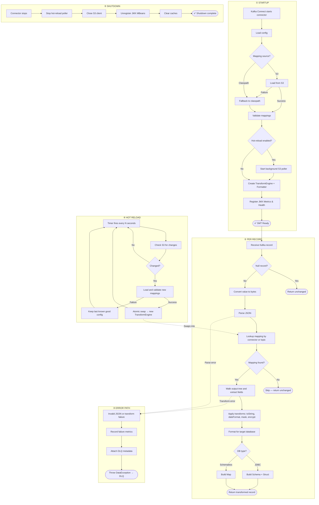

# SMT Workflow

```mermaid
flowchart TD
    subgraph STARTUP["① STARTUP"]
        A1["Kafka Connect starts connector"] --> A2["Load config"]
        A2 --> A3{"Mapping source?"}
        A3 -->|S3| A4["Load from S3"]
        A4 -->|Success| A6["Validate mappings"]
        A4 -->|Failure| A5["Fallback to classpath"]
        A3 -->|Classpath| A5
        A5 --> A6
        A6 --> A7{"Hot-reload enabled?"}
        A7 -->|Yes| A8["Start background S3 poller"]
        A7 -->|No| A9["Create TransformEngine + Formatter"]
        A8 --> A9
        A9 --> A10["Register JMX Metrics & Health"]
        A10 --> A11(["✅ SMT Ready"])
    end

    subgraph RECORD["② PER RECORD"]
        B1["Receive Kafka record"] --> B2{"Null record?"}
        B2 -->|Yes| B3(["Return unchanged"])
        B2 -->|No| B4["Convert value to bytes"]
        B4 --> B5["Parse JSON"]
        B5 --> B6["Lookup mapping by connector or topic"]
        B6 --> B7{"Mapping found?"}
        B7 -->|No| B8(["Skip — return unchanged"])
        B7 -->|Yes| B9["Walk output tree and extract fields"]
        B9 --> B10["Apply transforms: toString, dateFormat, mask, encrypt"]
        B10 --> B11["Format for target database"]
        B11 --> B12{"DB type?"}
        B12 -->|JDBC| B13["Build Schema + Struct"]
        B12 -->|Schemaless| B14["Build Map"]
        B13 --> B15(["Return transformed record"])
        B14 --> B15
    end

    subgraph ERROR["③ ERROR PATH"]
        E1["Invalid JSON or transform failure"] --> E2["Record failure metrics"]
        E2 --> E3["Attach DLQ metadata"]
        E3 --> E4(["Throw DataException → DLQ"])
    end

    subgraph HOTRELOAD["④ HOT RELOAD"]
        H1["Timer fires every N seconds"] --> H2["Check S3 for changes"]
        H2 --> H3{"Changed?"}
        H3 -->|No| H1
        H3 -->|Yes| H4["Load and validate new mappings"]
        H4 -->|Success| H5["Atomic swap → new TransformEngine"]
        H4 -->|Failure| H6["Keep last known good config"]
        H5 --> H1
        H6 --> H1
    end

    subgraph SHUTDOWN["⑤ SHUTDOWN"]
        S1["Connector stops"] --> S2["Stop hot-reload poller"]
        S2 --> S3["Close S3 client"]
        S3 --> S4["Unregister JMX MBeans"]
        S4 --> S5["Clear caches"]
        S5 --> S6(["✅ Shutdown complete"])
    end

    A11 --> B1
    B5 -.->|Parse error| E1
    B9 -.->|Transform error| E1
    H5 -.->|Swaps into| B6
```
